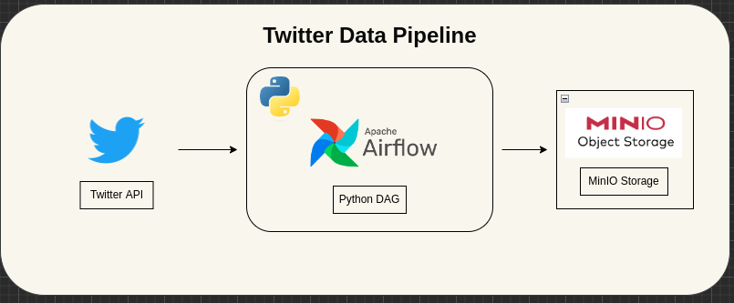

# Twitter Data Pipeline with apache-airflow & MinIO

## Table of Contents

- [About](#about)
- [Getting Started](#getting_started)
- [Usage](#usage)
- [Resources](#resources)
- [etc.](#licence)

## About <a name = "about"></a>

A simple example of Data Pipeline using apache-airflow (Orchestrator) and MinIO(Object Storage like s3).

## Getting Started <a name = "getting_started"></a>

Below is a design of the project. (The drawio file can be found in `docs/architecture.drawio`:


## Prerequisites

- [docker-compose](https://docs.docker.com/compose/)


## Usage <a name = "usage"></a>
We need to create and `.env` from [sample.env](./sample.env):
```bash
cp sample.env .env
```


We can simply run the pipeline using `docker-compose`.

To start
```bash
docker compose up -d
```

To shutdown
```bash
docker compose down
```

Then we can connect the below respectively:
- Apache-Airflow: http://localhost:8080
- MinIO Console: http://localhost:9090

## Resources <a name = "resources"></a>
- [apache-airflow](https://airflow.apache.org)
- [MinIO](https://min.io)
- [docker-compose](https://docs.docker.com/compose/)

## License

This project is licensed under the MIT License - see the [LICENSE](LICENSE) file for details.

## Credits

See as you fit.

## Contact

If you have any questions or would like to get in touch, you can email: <mike.kenneth47@gmail.com>  OR [twitter](https://twitter.com/mikekenneth77)